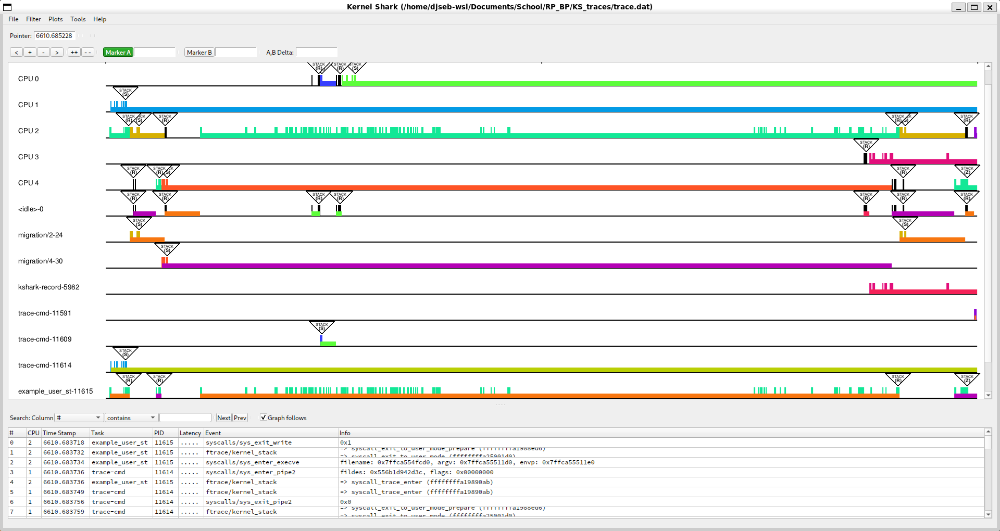
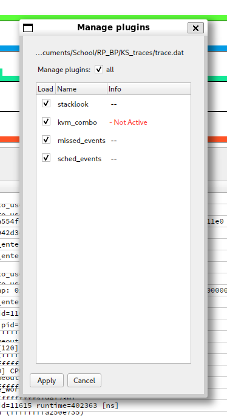
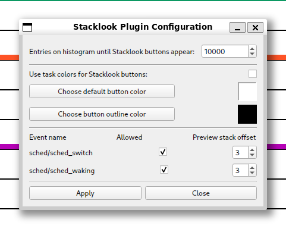
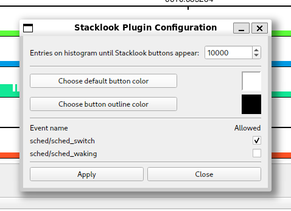
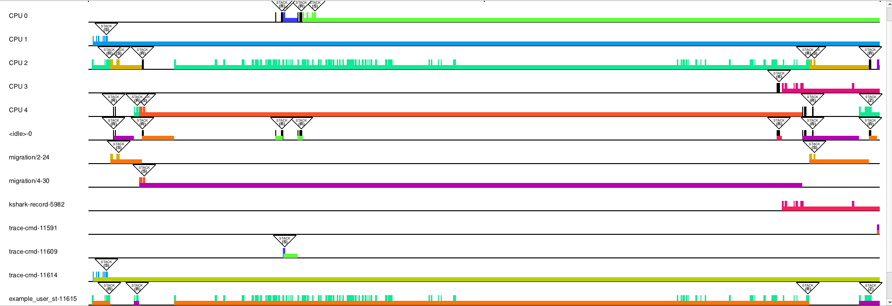
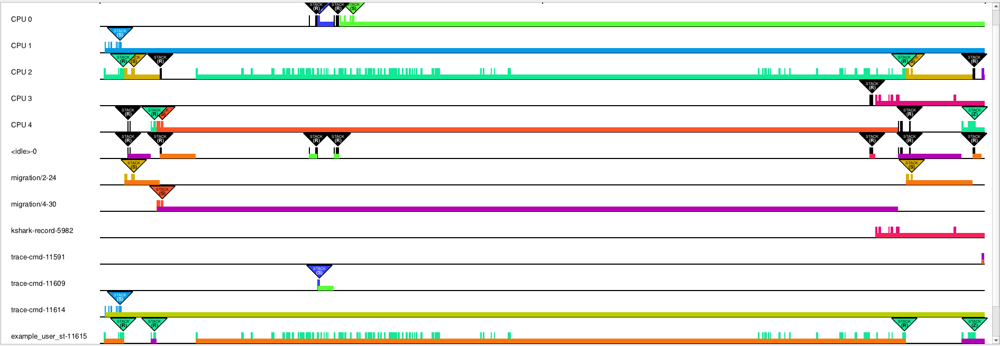
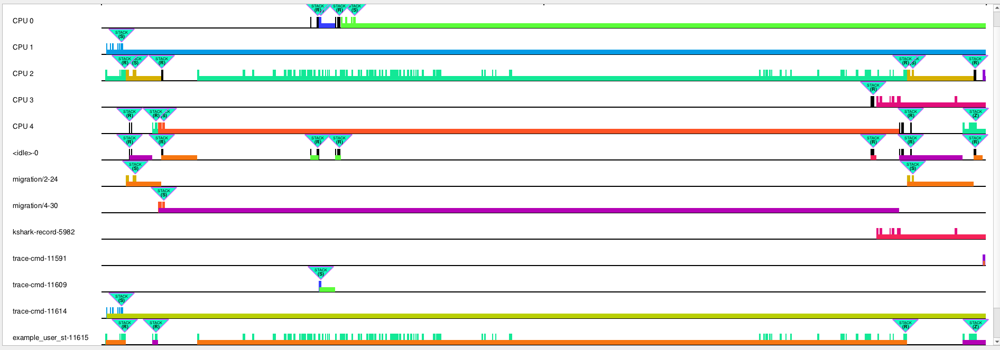
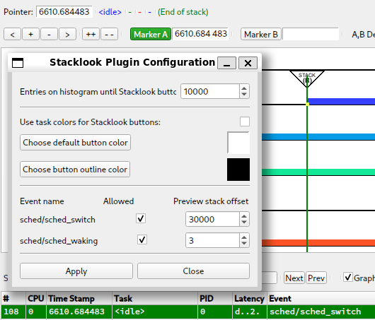
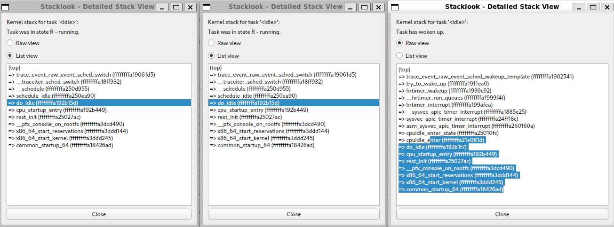

# Intro

This document serves as a simple to grasp manual for the "Stacklook" KernelShark plugin.

Figure 1.

# "How do I build and install Stacklook?"

## Prerequisites

- CMake of version at least 3.1.2
- KernelShark and its dependencies
  - version *2.4.0-couplebreak* and higher for custom KernelShark
  - version *2.3.2* for unmodified KernelShark
- Doxygen for documentation

## Compatibility

Plugin is compatible with KernelShark's **custom** version *2.4.0-couplebreak* and higher.
Unmodified KernelShark usage is achievable through a build argument. Unmodified KernelShark removes
these features from the plugin:
- Buttons optionally being the same color as the task is in the graph
- Mouse hover showing a preview of the kernel stack with an adjustable stack offset for it in the configuration

No other dependencies are necessary, except maybe the standard libraries of C and C++ and Doxygen for documentation. 

## Build and install only this plugin

1. Set your working directory in terminal as the build directory (best created in the project's root directory (see
   [README](../../README.md)), if not already present).
2. Run `cmake ..` command (if the main `CMakeLists.txt` file isn't in the parent folder, provide cmake with its
   valid location).
   - If using an unmodified KernelShark copy, add `-D_UNMODIFIED_KSHARK` to the command.
   - If **Doxygen documentation** is desired, include `-D_DOXYGEN_DOC=1` in the command.
   - By default, the **build type** will be `RelWithDebInfo` - to change this, e.g. to `Release`, use the option 
     `-DCMAKE_BUILD_TYPE=Release`.
   - If **Qt6 files** aren't in `/usr/include/qt6`, use the option `-D_QT6_INCLUDE_DIR=[PATH]`, where `[PATH]` is 
     replaced by the path to the Qt6 files.
     - Build instructions still expect that the specified directory has same inner structure as the default case (i.e. 
       it contains `QtCore`, `QtWidgets`, etc.).
   - If **KernelShark source files** aren't in the relative path `../KS_fork/src` from this directory, use
     the option `-D_KS_INCLUDE_DIR=[PATH]`, where `[PATH]` is replaced by the path to KernelShark source files.
   - If **KernelShark's shared libraries** (`.so` files) aren't in `/usr/local/lib64`, use the option
     `-D_KS_SHARED_LIBS_DIR=[PATH]`, where `[PATH]` is replaced by the path to KernelShark shared libraries.
3. Run `make` while still in the `build` directory.
   - If only a part of building is necessary, select a target of your choice.
   - Just running `make` builds: **the plugin** (target `stacklook`), **symlink** to the plugin SO 
     (target `stacklook_symlink`) and, if specified, the **Doxygen documentation** (target 
     `docs`).
4. (**Installation**) Plug in the plugin into KernelShark - either via KernelShark's GUI or when starting it via the 
   CLI with the `-p` option and location of the symlink or the SO itself.
   - **IMPORTANT**: Always install/load the plugin before loading a session where said plugin was active! Failure to do
     so will result in KernelShark not completely loading configuration menus or may even crash the whole program.

Use `make clean` to remove built binaries.

## Building KernelShark from source and this plugin with it 

1. Ensure all source files (`.c`, `.cpp`, `.h`) of Stacklook are in the `src/plugins` subdirectory of your KernelShark 
   project directory.
2. Ensure the `CMakeLists.txt` file in said subdirectory contains instructions for building the plugin (copy the style 
   of other Qt-using GUI plugins). Adjust the build instructions if `_UNMODIFIED_KSHARK` build is desired.
3. Build KernelShark (plugins are built automatically).
4. (**Installation**) Start KernelShark. Plugins built this way will be loaded automatically. If that for some reason 
   failed, look for the SO as for any other default-built KernelShark plugin, again in GUI or via the CLI.

## WARNING - loading plugin twice

If you have two or more versions of the plugin, do **NOT** load them at the same time - doing so **WILL CRASH** the 
program. Use either one or the other, but **NEVER BOTH**.

# "How do I enable/disable Stacklook?"

Enabling the plugin is very simple. All one has to do is open KernelShark and navigate to 
`Tools > Manage Plotting plugins` toolbar menu button. If the plugin was loaded via the command-line interface,
it will be shown in the list of plotting plugins as a checkbox plus the name, checkbox already being ticked.
If not, it is possible to search for the plugin via provded `Tools > Add plugin` button - it's sufficient to
find the symlink, but searching for the actual shared object file is possible too. As you can see, the plugin
follows standard KernelShark plugin loading behaviour.

Figure 2.

Ticked checkbox means the plugin is enabled, empty checkbox means the plugin is disabled.

# "How do I use Stacklook?"

## Configuration

Plugin configuration can be done at any time, even before any trace file is loaded. To change it, simply open the 
configuration dialog window through `Tools > Stacklook Configuration` in the main window. There can be only one 
configuration window open (figure 3).

Figure 3.

If using the unmodified build, the configuration window will be missing the checkbox for task colors and the stack
offset for the preview labels (figure 4).

Figure 4.

Now to explain each of the options and how to control them. In top to bottom order:
- *Histogram entries limit* - Decrease this number to force Stacklook to activate only if there are less than or
  equal to this many entries visible. Lesser the number, greater the zoom necessary to activate Stacklook. Minimum
  is set to 0, maximum is 1 000 000 000 (one billion) - though this high of a value will hardly ever become useful.
  By default, the value is 10 000 (ten thousand).
- *Use task colors for Stacklook buttons* - Check this box (if present) to color Stacklook's buttons' filling color
  according to the task which owned the event Stacklook found kernel stack trace for. Keep it disabled to use default
  Stacklook button colors (figure 6). By default, this option is off.
  
  Figure 5.
  
  Figure 6.
- *Stacklook button & outline colors* - The "Choose" buttons will bring up a color dialog, allowing one to pick
  a color to be used for Stacklook button's filling or a color its outline. These are effective only if the task color
  checkbox either is not present or is not checked. Next to this button is a space to show what colors are currently
  picked for the buttons. By default it is white for filling, black for outline. See example in figure 7 below.
  
  Figure 7.
- *Per-event configurations* - Each event is assigned a checkbox toggling Stacklook on or off for an event entry and 
  (if present) an spinbox with an offset into the kernel stack, which is used to read the "most interesting" events 
  from the kernel stack trace. The maximum value of the offset is the 100 000 000 (one hundred million), minimum is 0. 
  Again, the maximum value will probably never be used. By default, the values for each event are allowed (checked) and
  offset of 3.
  - To reiterate, the spinbox will not appear if the unmodified KernelShark version of the plugin is used. 

The `Apply` button will save the changes made an close the dialog - if not pressed, changes made won't take effect. 
Only active confguration values show up in the control elements - the configuraton window doesn't persist changes made 
to it after closing, unless they were applied. The `Close` button and top-right corner X button will discard changes 
made in the window and close the dialog.

There is no configuraton of:
- Supported events - plugin currently only support `sched/sched_switch` and `sched/sched_waking`
- The text in stacklook windows
- The text in stacklook buttons
- Stacklook button sizes
- Stacklook button positions

## In the graph

After loading (and maybe configuring) the plugin, zoom in until less than the configured number of visible entries are 
visible in the graph. A button will show up above each supported entry, colored by the default color in the 
configuration, or if using custom KernelShark and having the corresponding option on, colored like the task in the 
graph. The task color option is fully compatible with KernelShark's color slider.

The plugin won't show the buttons above event entries that aren't `sched/sched_switch` or `sched/sched_waking`, or if
such entries are missing their kernel stack trace event.

### Hovering over buttons

*If using custom KernelShark*, hover over any button and look at the top-left quarter of the screen. You will see the
preview label's contents change to have:
- Task name as the leftmost (first) entry.
- First item in the kernel stack, offset by configured number for this event type from the stack's top (where the
  newer entries go)
- Item in the kernel stack after the first item
- Item in the kernel stack after the second item
- Either three dots "...", signifying that the kernel stack has more entries than these or "(End of stack)" message,
  signifying there are no more items to display after the ones shown.

See figure 8 for a small showcase. Included is also the Stacklook window (more on that later below) and the kernel
stack trace in the main window's list view of all events - both to really show that the items in the preview are 
in the kernel stack (chosen offset was the default of 3). There's also a red circle highlighting the entry the mouse
cursor hovered over. 

Figure 8.

It is possible to set the offset so high that only last one, two, three entries are shown or none at all in the 
preview. In that case, Stacklook shows just a dash and a the "(End of stack)" message (figure 9). 

Figure 9.

### Double-clicking on buttons

Upon double-clicking a Stacklook button, a new window will open. This is a *Stacklook window*, which shows a message
that we are viewing a kernel stack of a task (whose name is shown at the sentence's end). Below it is a note about
whether task has woken up (which shows only for `sched/sched_waking` events) or about its previous state (only for
`sched/sched_switch` events). Then two radio buttons and the view with the kernel stack taken at the time of the event 
entry is shown. The radio buttons toggle what kind of view is used for the kernel stack.
- *By default*, the view is set as raw text, which means the kernel stack is just a string with newlines - this is 
  useful for copying the stack as a single string or for highlighting only a specific part of a stack item.
- *Alternatively*, the stack can be viewed in list view, which allows for simpler and quicker highlighting of a single 
  line.

Thre can be multiple windows present for a single entry, there can be multiple windows open for different entries and
any mix of the two previous situations.

All of the above for this section can be seen below in figure 10.

Figure 10.

Toggle between the raw text view and the list view using two radio buttons above the stack view area.

The window can be closed with the `Close` button at the very bottom of the window or with the X button of the 
window's header. Last option is to close the main KernelShark window, which will close all of Stacklook's opened 
windows.

## Using Stacklook as a library

See technical documentation, as this is not intended usage of the plugin and such usage explanations will be omitted.

# Bugs & glitches

If multiple stacklook buttons would lay over one another, the one belonging to an *earlier* event will be 
drawn above a button for an event happening *later*, **BUT** clicking on or hovering over overlaid buttons will select 
the button for the *later* event. This is, to the author's knowledge, something internal to KernelShark and cannot be
fixed on the plugin side.

Opening a KernelShark session where Stacklook was active, but without preloading it will result in a segmentation
fault and a **crash** upon hovering over a Stacklook button.

If more are discovered, contact the author via e-mail `djsebofficial@gmail.com`.

# Recommendations

A few recommendations of usage by the author for the smoothest user experience.

Always preload Stacklook before loading a session. It can save the program from nasty surprises.

Do not open hundreds upon hundreds of stacklook windows, lest you wish your memory to suffer.

It is recommended to not set the histogram limit in the configuration too high as to not make the plugin use
too much memory with many of stacklook's buttons being present.

While KernelShark's sessions work, they are a little buggy. This plugin attempts its best to not get in the way of
their inner logic, but a warning should be issued that if the plugin isn't loaded beforehand, there might be
unexpected behaviours, e.g. loading a session when the plugin was active won't add the plugin's menu to the
`Tools` menu.